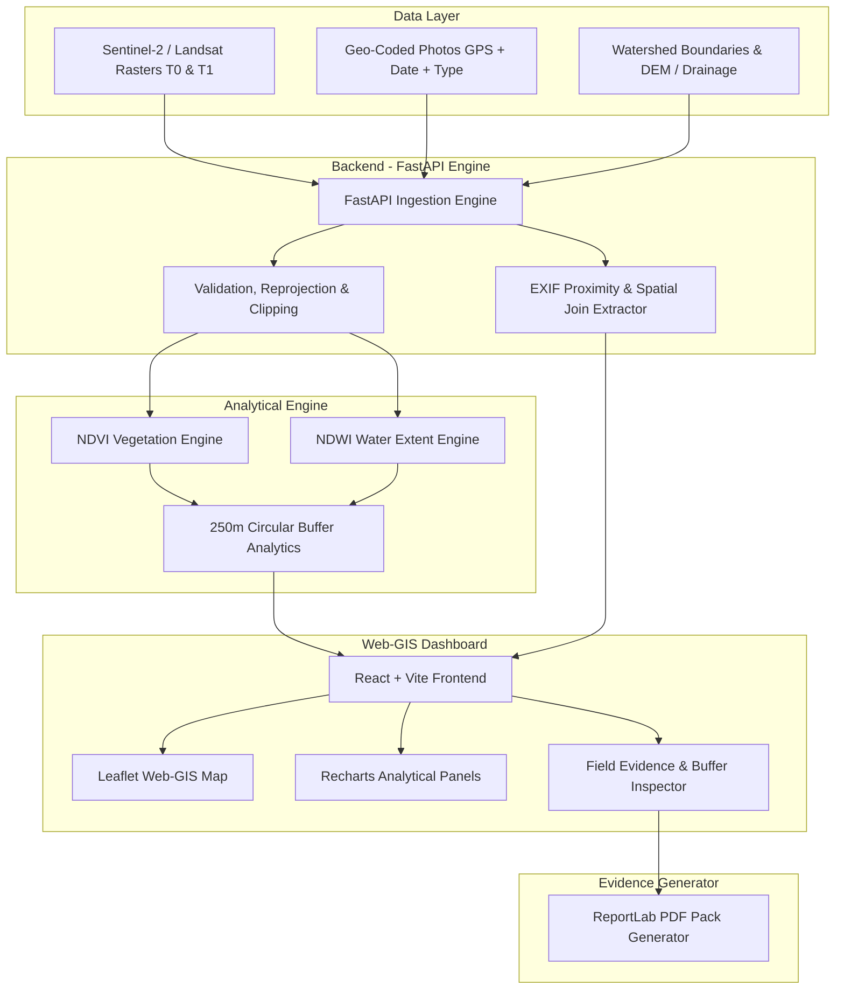

# 🛰️ Watershed Insight (PS26015)

<div align="center">


**An AI-Assisted Geospatial Decision-Support Platform for Micro-Watershed Development & Impact Assessment**

*SRISHTI-DRISHTI Aligned Platform for Department of Land Resources (DoLR)*

---

</div>

## 📌 Executive Summary & Problem Framing

Existing watershed management systems collect and visualize large volumes of heterogeneous spatial data (SRISHTI Web-GIS layers and DRISHTI field-collected geo-tagged photographs). However, converting these raw observations into **integrated, interpretable, and decision-ready evidence** remains a major challenge.

**Watershed Insight** solves this gap:
$$\text{DATA} \longrightarrow \text{INFORMATION} \longrightarrow \text{ANALYSIS} \longrightarrow \text{INTERPRETATION} \longrightarrow \text{DECISION SUPPORT}$$

Instead of replacing the existing data collection ecosystem, Watershed Insight acts as an **analytical layer on top of SRISHTI-DRISHTI**, automatically cross-referencing satellite spectral indicators ($NDVI, NDWI$) with 250m intervention buffer zones and field photographs to generate automated **PDF Evidence Reports**.

---

## 🔗 The Golden Analytical Chain

```
┌─────────────────┐       ┌────────────────────────┐       ┌─────────────────────────┐
│ Satellite Data  │ ────► │ Geo-Processing Engine  │ ────► │  Intervention Analysis  │
│ (Sentinel T0/T1)│       │ (NDVI & NDWI Deltas)   │       │ (250m Circular Buffer)  │
└─────────────────┘       └────────────────────────┘       └────────────┬────────────┘
                                                                        │
┌─────────────────┐       ┌────────────────────────┐                    │
│ PDF Evidence    │ ◄──── │   Web-GIS Dashboard    │ ◄──────────────────┘
│ Report Export   │       │ (Leaflet & Recharts)   │
└─────────────────┘       └────────────────────────┘
```

---

## 🧩 Five Core Modules

| Module # | Name | Core Functionality & Purpose |
| :--- | :--- | :--- |
| **Module 1** | **Watershed Explorer** | Interactive Web-GIS workspace supporting location selection (`State` $\rightarrow$ `District` $\rightarrow$ `Project` $\rightarrow$ `Micro-Watershed`). Toggles micro-watershed boundaries, intervention pins, DRISHTI photo markers, and satellite rasters. |
| **Module 2** | **Geo-Coded Photo Intelligence** | GPS-aware photo inspector parsing EXIF metadata (`GPSLatitude`, `GPSLongitude`, `DateTimeOriginal`). Automatically calculates spatial proximity and binds field photographs to nearest IWMP structures. |
| **Module 3** | **Satellite Change Detection** | Temporal raster analytics engine computing $NDVI = \frac{NIR - Red}{NIR + Red}$, $NDWI = \frac{Green - NIR}{Green + NIR}$, and delta change maps ($\Delta = T_1 - T_0$). |
| **Module 4** | **Intervention Impact Analysis** | Spatial buffer extraction algorithm analyzing satellite metrics specifically within a 250m circular radius around Check Dams, Farm Ponds, Plantations, and Contour Bunds. |
| **Module 5** | **Evidence Generator** | Automated ReportLab PDF generator creating official multi-page evidence reports with photos, GPS stamps, satellite indicator delta tables, analytical synthesis notes, and scientific limitations. |

---

## 🏛 System Architecture



---

## 📡 Backend REST API Specifications

| Method | Endpoint | Description |
| :--- | :--- | :--- |
| `GET` | `/api/v1/watersheds` | Returns micro-watershed GeoJSON boundary & summary statistics |
| `GET` | `/api/v1/interventions` | Returns list of IWMP interventions with coordinates & types |
| `GET` | `/api/v1/photos` | Returns DRISHTI field photos with EXIF metadata & static URLs |
| `GET` | `/api/v1/interventions/{id}/analysis` | Runs 250m buffer analysis ($T_0$ vs $T_1$ $NDVI, NDWI$, water area delta, synthesis) |
| `POST` | `/api/v1/reports/pdf` | Generates and downloads ReportLab PDF Evidence Report for intervention |

---

## 🗄 Project File Structure

```
Watershed-Insight/
├── backend/
│   └── app/
│       └── main.py              # FastAPI application & REST endpoints
├── geospatial/
│   └── raster_processor.py      # NDVI/NDWI & 250m buffer analysis engine
├── reports/
│   └── pdf_generator.py         # ReportLab PDF Evidence Pack generator
├── scripts/
│   └── generate_sample_data.py  # Synthetic sample dataset builder (GeoJSON, Rasters, EXIF)
├── data/
│   └── sample/                  # Boundaries, Interventions, Satellite Rasters, Field Photos
├── frontend/
│   ├── src/
│   │   ├── components/          # Navbar, Sidebar, WatershedMap, AnalyticsPanel, Modal
│   │   ├── App.jsx              # Application state & API orchestration
│   │   ├── index.css            # Custom glassmorphism & dark slate design system
│   │   └── main.jsx             # React entry point
│   ├── package.json             # Frontend npm dependencies
│   └── vite.config.js           # Vite dev server proxy setup
├── .gitignore
├── README.md
└── walkthrough.md               # End-to-end verification walkthrough & screenshots
```

---

## 🚀 Quickstart Guide

### Prerequisites
- **Python 3.10+**
- **Node.js v18+ & npm**

### Step 1: Install Python Dependencies
```bash
python -m pip install fastapi uvicorn geopandas rasterio shapely matplotlib pydantic reportlab piexif
```

### Step 2: Generate Sample Geo-Spatial Dataset
```bash
python scripts/generate_sample_data.py
```

### Step 3: Launch FastAPI Backend Server
```bash
python -m uvicorn backend.app.main:app --host 127.0.0.1 --port 8000
```

### Step 4: Launch React Web-GIS Frontend
In a separate terminal window:
```bash
cd frontend
npm install
npm run dev
```

Open `http://localhost:3000` in your web browser.

---

## ⏱️ 3-Minute SIH Presentation Script

1. **0:00–0:30 (Problem Statement)**: Explain the gap between collected geo-coded field photos (DRISHTI) and satellite monitoring (SRISHTI) for DoLR officers.
2. **0:30–1:00 (Watershed Explorer)**: Select pilot micro-watershed (`MWS-MH-2025-014`). Show boundary layer, intervention markers, and photo pins.
3. **1:00–1:40 (Change Detection)**: Compare baseline $T_0$ (Pre-intervention) vs $T_1$ (Post-intervention), demonstrating $NDVI$ vegetation growth (+75%) and surface water expansion (+1.73 Ha).
4. **1:40–2:10 (250m Buffer Evidence)**: Click Masonry Check Dam #001 pin. Show 250m buffer analysis, attached DRISHTI photo, GPS EXIF stamp, and indicator deltas.
5. **2:10–2:40 (Evidence PDF Pack)**: Click **"Download PDF Evidence Report"** to instantly generate the ReportLab PDF evidence document.
6. **2:40–3:00 (Conclusion)**: Pitch the core message: *"Watershed Insight turns satellite imagery and field photos into spatially validated, decision-ready evidence."*

---

## 📜 License & Acknowledgments

This project is licensed under the **MIT License**.
Developed for **Smart India Hackathon 2026** under Problem Statement **PS26015** (Ministry of Rural Development / Department of Land Resources).
